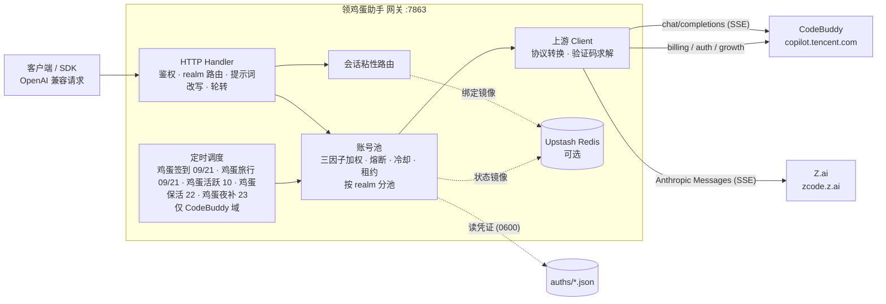

<p align="center">
  
</p>

<h1 align="center">领鸡蛋助手</h1>

<p align="center">
  <b>把多家上游账号池聚合成一个 OpenAI 兼容 API 的自托管网关 · 附 Web 管理面板</b><br>
  上游：腾讯 CodeBuddy + 智谱 Z.ai（GLM） · Web 面板 · OAuth 浏览器登录 · 账号池轮转 · 熔断与冷却 · 会话粘性<br>
  定时鸡蛋签到 / 鸡蛋活跃 / 鸡蛋旅行 / 鸡蛋保活 · 成长任务一键完成（17/18） · 流式 / 非流式 · 全协议双向转换
</p>

<p align="center">
  
  
  
  
  
</p>

---

> **本项目是 [Sliverkiss/workbuddy2api](https://github.com/Sliverkiss/workbuddy2api) 的增强分支**（fork）。
> 在上游基础上重构了可视化运维层、补齐了 Z.ai 第二条上游通道，并同步了上游全部功能更新。
> 差异概览见 [与上游的差异](#与上游的差异)；上游设计的精巧之处（账号池调度、错误分类、提示词体系）原样保留。

## 项目简介

领鸡蛋助手 是一个自托管的 **OpenAI 兼容反向代理网关**，把多个上游的账号池包装成统一的 `/v1/chat/completions` 服务。当前支持两条上游：

| 上游 | 账号域 | 协议 | 端点 |
|---|---|---|---|
| 腾讯 **CodeBuddy** | `cn` / `global` | 私有（逆向） | `copilot.tencent.com` 等 |
| 智谱 **Z.ai**（GLM） | `zai` | Anthropic Messages | `zcode.z.ai` / `api.z.ai` |

- 官方均不提供 OpenAI 形态的开放 API，本项目通过 **OAuth 设备授权**（CodeBuddy）或 **令牌导入**（Z.ai）获取账号凭证，在网关侧做 token 自动刷新、账号池调度与流量治理；
- 面向 **个人多账号** 场景：多账号共享、单号故障自动换号、冷却 / 熔断防止雪崩、会话粘性保证多轮上下文不跳号；
- 对客户端只暴露 OpenAI 兼容接口，现有 SDK / 前端 / 工具 **零改造接入**。

模型名用 `realm:` 前缀路由到对应上游，例如 `deepseek-v4-flash`（裸名 → cn 池）、`global:xxx`、`zai:GLM-5.3`。裸名恒落 cn 池，不会误路由。

> ⚠️ 合规须知：本项目是**非官方**网关，使用上游账号作为转发凭证，**仅限本人授权账号、本机 / 私有环境测试**。详细边界见[安全与合规](#安全与合规)。

## 核心能力

| 能力 | 说明 |
|---|---|
| 🔑 **账号接入** | CodeBuddy 走 `login.sh` / 面板设备授权；Z.ai 走面板「Z.ai 令牌」导入（`POST /panel/api/import/zai`） |
| 🔄 **多账号池** | 三因子加权随机选号（积分占比 ×10 + 闲置补偿 + 成功率 ×3），Top-5 候选 + 防惊群；**按 realm 分池隔离**，跨域不串号 |
| 🧩 **双上游协议转换** | 对外统一 OpenAI 协议；CodeBuddy 侧请求体改写 + SSE 白名单重建；Z.ai 侧 Anthropic Messages ↔ OpenAI 双向转换（`internal/server/convert_zai.go`） |
| 🔐 **Z.ai 验证码求解** | Plan 通道每请求需阿里云无痕验证参数，内置 Node 求解器（happy-dom 免真浏览器）+ 45s 缓存 + 挑战自动重解重试 |
| 🛡️ **熔断与冷却** | 429 软冷却 600s 起指数退避（封顶 `soft_rate_max`）、404 固定 60s 短冷却、余额耗尽硬冷却至次日 04:00、连续失败熔断、在途租约限流 |
| 🎯 **模型级避让** | `(账号, 模型)` 负缓存：某模型在该账号不可用时只避该模型，不连坐同账号其它模型 |
| 🧲 **会话粘性** | 同一会话（`conversation_id`）尽量绑定同一账号，TTL 滚动续期，失败自动解绑，可镜像 Redis 防重启丢失 |
| ⏰ **定时任务** | 鸡蛋签到（09/21 点，末尾自动跑**连登管家**：兑换已解锁档位 + 抽完抽奖次数）+ 鸡蛋活跃（10 点）+ 鸡蛋旅行（09/21 点）+ 鸡蛋保活（22 点）+ 鸡蛋夜补（23 点），五类独立开关（**仅 CodeBuddy 账号**，Z.ai 账号自动跳过） |
| ⚡ **流式 + 非流式** | 出站强制 `stream:true`；SSE 帧按规范白名单重建；非流式由本地聚合为单响应 |
| 🧠 **推理模型兼容** | DeepSeek 思维链注入（`thinking.type=enabled` + 默认档）、`reasoning_content` 多轮回填、effort 档位自动降级 |
| 💬 **系统提示词体系** | 网关自有提示词替换客户端 system（默认 `custom`），从源头消灭 system 来源的内容误报；`passthrough` 遇拦截自动降级重试 |
| 🗑️ **指纹脱敏** | 出站请求体黑名单指纹字段清洗（可关闭），与提示词体系两层叠加 |
| 📊 **可观测** | 每请求一行表格日志（TTFB / token 速率 / uid）；`/healthz` 与 `/status` 按域（cn / global / zai）透出可用性 |
| 💾 **状态持久化** | 池状态本地原子落盘 + Upstash Redis 异步镜像（可选），重启择新恢复 |
| 🖥️ **Web 管理面板** | 内嵌单页面板（明暗主题）：账号运维 / 模型档位查询 / 在线改配置（热生效）/ 运行日志 / 积分任务 |

## 上游：Z.ai（智谱 GLM）

Z.ai 账号落在独立账号域 `zai`，与 CodeBuddy 账号**同池管理、完全隔离**：realm 谓词过滤选号，且不参与 CodeBuddy 的鸡蛋签到 / 任务 / 鸡蛋旅行 / 鸡蛋保活排程（对其无意义，也避免无谓的上游调用）。

### 两条通道

| 通道 | 端点 | 鉴权 | 验证码 | 计费 |
|---|---|---|---|---|
| **Plan 通道**（默认） | `https://zcode.z.ai/api/v1/zcode-plan/anthropic` | `Authorization: Bearer <zcodejwttoken>` | **每请求必需** | ZCode 套餐额度（免费 / 付费套餐共用） |
| API Key 通道 | `https://api.z.ai/api/anthropic` | `x-api-key` | 免 | 用户 BigModel / Z.ai 按量计费 |

常量见 `internal/upstream/zai.go`（`ZaiPlanChatBase` / `ZaiApiKeyChatBase`），默认走 Plan 通道。

### 模型

| 模型名 | 上下文 | 最大输出 | 备注 |
|---|---|---|---|
| `zai:GLM-5.3` | 1M | 131072 | 旗舰 |
| `zai:GLM-5.3-Flash` | 1M | 131072 | 快模型，日额度更大 |

上游模型名**大小写敏感**，网关把客户端小写别名映射为官方名（`glm-5.3` → `GLM-5.3`，见 `internal/server/convert_zai.go` 的 `zaiModelNameMap`）。额度**按模型分池**，互不占用。

### 添加账号

面板 →「Z.ai 令牌」标签 → 粘贴凭证 JSON（`POST /panel/api/import/zai`，需 Bearer 鉴权）。Plan 通道需要的是 **`zcodejwttoken`**（三段式 JWT，非 API Key；用 API Key 走 Plan 通道会被判 401）。API Key 通道账号同样从此入口导入。

### 验证码求解（Plan 通道）

Plan 通道每个模型请求都必须携带 `X-Aliyun-Captcha-Verify-Param`（阿里云无痕验证），缺失即 `400 + code 3007`。网关内置求解器在**服务端**解出，无需真浏览器：

- 求解器位于 `captcha_node/`（Node + happy-dom 模拟浏览器环境），随发布包 / 容器镜像分发；**要求运行环境有 Node**
- 参数 TTL **45s**，进程内缓存复用；并发请求共享同一次求解（去重）
- 单次求解成功率约 **6 成**（SDK 侧偶发 stall），失败自动重试（`zaiCaptchaAttempts` = 5）
- 上游回 `3007` 时失效缓存，并在**同一请求内**重新求解后重试一次（验证码问题不是账号问题，不轮换、不罚号）

| 环境变量 | 作用 |
|---|---|
| `ZCODE_CAPTCHA_DISABLED=1` | 关闭求解（无 Node 环境，或只用 API Key 通道） |
| `ZCODE_CAPTCHA_SOLVER` | 指定 `solver.js` 的绝对路径 |
| `ZCODE_NODE_PATH` | 指定 Node 可执行文件路径 |
| `ZCODE_DEVICE_MID` | 覆盖设备 ID（默认按账号 uid 派生稳定值） |

### 错误码语义

上游用**业务信封**承载拒绝，形态包括 `HTTP 200 + application/json + {"code":N,...}`（额度类最常见）与 4xx：

| 码 | 文案 | 处置 |
|---|---|---|
| `1005` | `exceed quota limit` | **模型级**日额度耗尽 → `(账号,模型)` 避让，同账号其它模型照常可用 |
| `3012` | `unusual activity` | 上游风控 → 账号软冷却 + IP 级 fail-fast（继续换号只会加剧风控） |
| `3007` | 验证码校验失败 | 失效缓存 → 同请求内重解重试一次 |
| `1113` | `Insufficient balance or no resource package` | 余额 / 资源包耗尽 → 硬冷却至次日 04:00 |

> 为什么 `1005` 不能按账号级冷却：Z.ai 额度按模型分池。若把 1005 当成账号级硬冷却，会把同账号仍有余量的其它模型一并关停（真实场景：GLM-5.3 日额度用尽时 GLM-5.3-Flash 仍可正常调用）。

### 协议与指纹

- **协议转换**：对外 OpenAI，入站转 Anthropic Messages（注入官方 system 身份块、末条消息 `cache_control`、`metadata.user_id`、模型名映射），响应 Anthropic SSE → OpenAI SSE 帧。全部收在 `internal/server/convert_zai.go`
- **身份头**：Plan 通道需伪装官方 ZCode 桌面端指纹（macOS 平台头）且**只发 3 个追踪头**（`x-request-id` / `x-zcode-session-type` / `x-zcode-trace-id`）——多发 `x-query-id` / `x-session-id` 会被判 3012。见 `internal/upstream/zai.go` 的 `applyZaiIdentityHeaders`

## 成长任务一键完成（17/18）

官方「成长计划」的 18 个成长任务中，**17 个可在面板上一键纯 API 完成**——无需安装官方客户端、无需人工交互，点一下「一键完成」即自动推进进度、等待异步计分落定并**自动领奖**。剩余任务展示操作指引。

> 本节仅适用于 **CodeBuddy 账号**；Z.ai 账号无此任务体系，相关排程与入口自动跳过。

### 任务覆盖与奖励

| 任务 | 奖励 | 一键完成方式 |
|---|---|---|
| `first_buddy` | +300c +8e | 解锁上报 → 同意协议 → 领养第一只 Buddy |
| `create_canvas` | +300c +5e | 设计画布创建事件组（Ardot 遥测） |
| `chat_5` | +100c | 鸡蛋活跃 ×5（自动补足差额） |
| `Model_chat_GLM5.2` | +100c +5e | glm-5.2 真实对话一次（发一条短消息） |
| `RichMeow_Chat` | +100c +5e +UR Buddy | 桌面端对话事件链（6 事件，含成功回执） |
| `Buddy_App` | +100c +5e | Buddy 应用「发现→进入→授权」事件链 |
| `Buddy_App_QQ` | +50c +5e | 企鹅教师助手进入事件链（与上一条共用） |
| `automation_1` | +100c +5e | 定时任务创建成功事件 |
| `Library_read` | +100c +5e | 资料库阅读点击（web 域上报） |
| `template_5` | +100c +5e | 模板使用事件组 ×5 |
| `playbook_prompt` | +100c +5e | 灵感案例「做同款」发送事件 |
| `expert_5` | +100c +5e | 真实专家召唤+使用链 ×5（专家市场拉真实专家 → 真实对话 → 使用事件） |
| `Expert_team_use_3` | +100c +5e | 专家团召唤+使用链 ×3 |
| `Hp_Appearance` | +100c +5e | 主题设置 + 皮肤生效事件 |
| `Expert_lighthouse` | +100c +5e | 轻量云专家召唤+使用链（真实对话 requestId，**可免费领一个月轻量服务器**） |
| `skill_1` | +100c +5e | 真实对话 + 技能加载事件（skill_info） |

**全新账号一键全做完 ≈ +1950 credits +78 能量**，其中仅数个任务涉及真实对话（`Model_chat_GLM5.2` 一条、`expert_5`/`Expert_team_use_3`/`skill_1` 各数条 fast-model 短对话），其余全部为行为事件上报，零对话消耗。

### 不可自动的 1 个

| 任务 | 原因 |
|---|---|
| `Expert_Philanthropy` | 需真实捐款（服务端领奖时校验捐赠回执，已实测无法绕过） |

### 实现原理（简述）

任务计分走 `/v2/report` 行为上报，但**不同任务认不同客户端指纹**：CLI 指纹（`www.codebuddy.cn`）、桌面指纹（`copilot.tencent.com` + `WorkBuddy/5.5.6` UA + `workbuddy-desktop` 事件族）、web 指纹（`www.workbuddy.cn` + `x-client-platform: web`）。网关为每类任务构造对应指纹的判据事件链（`internal/upstream/desktop.go`）；专家类任务额外要求真实专家 id 与真实对话回执。上报 200 ≠ 计分——面板在执行后轮询任务进度，达标即自动调用 Web 域领奖接口。

> ⚠️ 行为事件按天幂等：重复点「一键完成」不会重复扣资源，已达标的任务自动跳过。

### 任务中心（面板视图）

「任务中心」视图把散落的任务能力收拢成一处：

- **全账号任务扫描**：一键拉取每个账号的成长任务（未完成且可自动化的 19 项，含小程序口径的「校园日」与「小程序首对话」）+ 开学季待办
- **执行队列**：把待办按账号排队执行——账号内串行（与单任务/一键完成共用互斥锁），账号间可选并发（1-3）；执行进度实时更新到每个条目
- **开学季独立状态卡**：每账号 5 任务的状态矩阵 + 剩余抽奖次数，一键触发全账号闭环
- **日志分频道**：运行日志按「任务 / 对话 / 系统」三频道筛选——对话流量再大，任务结果也不会被冲掉

### 开学季活动（5/5 全自动）

官方「AI 好 Buddy，开学有好礼」小程序活动的 5 个任务**全部纯 API 自动完成**（挂鸡蛋签到排程末尾，幂等）：

| 任务 | 奖励（每日） | 判据（已逆向） |
|---|---|---|
| 分享活动 | +100c +1抽奖 | `share-complete` 直调即点亮 |
| 桌面端体验（单次） | +100c +1抽奖 | viewed 激活 + 真实 chat + 桌面六事件链 |
| 和 AI 对话 3 次 | +50c +1抽奖 | viewed 后 3 条 `chat_request_send` 埋点（无需真实会话） |
| 召唤开学季专家 | +50c +1抽奖 | viewed 后 mp 事件链（召唤×3 + 对话） |
| 学生认证 | +100c | 需微信学生真实认证，不做 |

抽奖次数自动全部抽完。

同一活动在成长任务中心还有两条**小程序口径**任务（`X-Client-Platform: miniprogram` 专属下发，默认列表不可见，各 +100c+5e）：`school_season` 校园日（需 `activityId=school_open_day_2026`）与 `Sequential_Tasks_1` 小程序首对话。任务中心扫描自动合并 mp 口径待办；accept 带**登记回读验证**（上游存在 200+OK 但未落账的形态，未生效自动重试一次）。

### 连登兑换与抽奖（自动）

成长中心连登档位（连续登录 7/14/28 天）兑换后发放积分 / 能量 / 补签卡 / **抽奖次数**，抽奖次数只能从兑换获得。网关把它挂在每日鸡蛋签到排程末尾自动跑闭环（见[定时任务](#定时任务)）：档位解锁当天自动兑换、有抽奖次数自动抽完。

## 与上游的差异

本分支相对 [上游 master](https://github.com/Sliverkiss/workbuddy2api) 的增量（均已在真实多账号环境验证）：

### 新增

| 能力 | 说明 |
|---|---|
| **Z.ai（智谱 GLM）第二上游** | 独立账号域 `zai`，Anthropic Messages 协议，进出站双向转换；含阿里云无痕验证码服务端求解（Node + happy-dom）、官方客户端身份头仿真、业务信封错误码语义（1005 模型级额度 / 3012 风控 / 3007 验证码 / 1113 余额）。详见[上游：Z.ai](#上游zai智谱-glm) |
| **Web 管理面板** | `internal/panel`，前端 go:embed 单文件进二进制，零外部依赖。账号池可视化（健康色条 / 积分量条 / 冷却倒计时）、单号运维、批量任务、日志查看、明暗主题 |
| **浏览器内 OAuth 添加账号** | 面板「添加账号」按钮完成设备授权 → 凭证落盘 → **热加载进池（免重启）**，替代命令行 `login.sh` 流程 |
| **在线配置编辑（热生效）** | 面板直接改 `config.json`：API 密钥 / `soft_rate` / 脱敏开关 / 池参数 / 任务排程**立即生效**；装配期字段（listen 等）保存后提示需重启。写入采用深合并 + 原子替换，保留未知键 |
| **积分任务体系** | 任务列表 / 接受 / 领取接口 + 面板弹窗；「一键完成」覆盖 **17 个任务**，推进进度、等待异步计分落定后**自动领奖**，纯 API 零客户端依赖 |
| **首启自动生成配置** | 目录下无 `config.json` 时自动生成推荐配置（含 `crypto/rand` 随机 `api_key`），双击即开 |
| **粘性会话内容回退** | 客户端不发 `conversation_id` 时，用 `system + 首条 user` 哈希派生会话键（`d-` 前缀），通用 OpenAI 客户端也能享受粘性 |
| **鸡蛋余额刷新** | `schedule.balance_refresh_minutes`（默认 5）周期查余额并更新池，冷却账号余额恢复自动解冻 |
| **模型能力透出** | `/v1/models` 附带 `supported_efforts` / `default_effort` / 积分倍率 / 输入输出上限等上游真实字段 |
| **安全加固** | 常量时间密钥比较（`internal/httpauth`）、CSP 与安全响应头、UID 白名单防路径穿越、前端属性转义修复 |
| **领养前置修复** | 上游 `travelAdopt` 缺 report 前置导致领养恒失败于 `first_buddy task not completed yet`；本分支修正后实测 +300 到账（3/3 账号） |
| **健壮性修补** | 配置解析容忍 UTF-8 BOM（Windows 记事本另存不炸）；Windows 双击启动失败时停住显示错误（控制台不再一闪而过） |

### 同步上游

**第一轮（fork 基线 `53ee3a1` → `9a87758`，34 个提交）**：四类任务独立排程、pool 文件拆分、12153 连续计数才禁用、429 `code=6004` 模型级限流收窄、11101 不罚号、请求体 413、DeepSeek 思维链、reasoning_content 回填、Codex 指纹脱敏、系统提示词体系、出站 UA 可配等。

**第二轮（`9a87758` → `ea8b1e5`，2026-09-14，只吸收底层）**：

| 上游改动 | 吸收内容 |
|---|---|
| 净化增强 | `tool_calls.arguments` 盲区修复（content=null 的工具调用轮此前完全漏净化）、裸 `11-128` 反探测改写、桌面版身份句（逗号形态）漏网修复、反馈句整句改写 |
| 出站头族 | UA 对齐官方三段式 `WorkBuddy/<ver> WorkBuddy/<ver> CLI/<ver>`（默认 5.5.4/2.137.1，可配）；`X-IDE-*` 用量归属四头 + `X-Agent-Purpose`；`X-Device-Token` 设备风控头（auth 每号 / config / 文件三源）；`X-IDE-Version` 补齐 |
| 并发修复 | 客户端 IP 改按请求参数传递（消除共享字段竞态）；billing 单段 UA 形态 |
| 鸡蛋签到幂等 | `IsAlreadyCheckin` 识别"今天已签到"（code=10001/14001），调度日志不再把重复签到当失败 |
| 粘性按模型判活 | 会话绑定的账号被 6004 模型级限额后，换模型请求自动解绑重分配；`/healthz` 探活计入模型豁免形态 |
| report 增强 | `ReportChatActivity` 支持独立 `requestID`（同会话多轮上报各条可区分） |

未吸收（明确不做）：脚本体系（我们已有更完整的纯 API 实现）、governance/CI workflow、成本账本选号（依赖 usage.credit 观测，收益待验证）。

### 未做 / 待办

| 状态 | 事项 | 说明 |
|---|---|---|
| ❌ 未做 | **面板侧 Upstash / 凭证目录配置** | 涉及启动期装配，需手工编辑 `config.json`（面板会提示为重启项） |
| ❌ 未做 | **HTTPS / 内置限流** | 设计上交给反向代理（Nginx / Caddy）。服务本身只提供明文 HTTP，公网部署**必须**置于 HTTPS 反代之后 |
| ⚠️ 不支持 | **Z.ai 账号的成长任务 / 鸡蛋签到体系** | Z.ai 无对应活动接口，相关排程与面板入口对其自动跳过 |
| ⚠️ 不支持 | **`Expert_Philanthropy`** | 需真实捐款（服务端校验捐赠回执，实测无法绕过） |

## 架构总览



请求在出站前经历各自的改写管线：

- **CodeBuddy 域**（`internal/upstream/payload.go`）：强制 `stream:true`、`developer` 角色归一、`tool_choice` 归一、`image_url` 字符串兼容为 OpenAI 对象形态、DeepSeek 思维链注入、`reasoning_effort` 档位降级、`reasoning_content` 回填、指纹脱敏
- **Z.ai 域**（`internal/server/convert_zai.go`）：OpenAI Chat → Anthropic Messages（官方 system 身份块 + `cache_control` + `metadata.user_id` + 模型名映射），响应 Anthropic SSE → OpenAI SSE 帧

## 快速开始

### 环境要求

- **Docker + Docker Compose**（服务端部署方式，镜像内已含低权限用户、Node 运行时与全部工具脚本）——或
- **Windows / macOS / Linux 直接跑单文件二进制**（无需 Docker）
- 一个或多个已注册的上游账号：CodeBuddy（OAuth 登录）；如需 Z.ai 通道，另需 **Node 运行时**（验证码求解器依赖）
- 宿主机 Go ≥ 1.22（仅从源码构建时需要）

### 方式一：Docker Compose（推荐服务器部署）

```bash
# 1. 克隆
git clone https://github.com/dawn1115/lingjidan.git
cd lingjidan

# 2. 准备配置（compose 挂载此文件，缺失会导致容器启动失败）
cp config.example.json config.json
#    建议编辑 config.json 设置 api_key（或留空由程序自动生成随机密钥）

# 3. 启动（首次会构建镜像，约 1-2 分钟）
docker compose up -d --build

# 4. 健康检查（无可用账号时返回 503）
curl -s http://localhost:7863/healthz
# {"healthy":0,"total":0,"realm_servable":{...},"service":"workbuddy2api"}
```

启动后打开 **`http://localhost:7863/panel/`**，用面板添加账号（见下节）。镜像内已装 `nodejs` 并带 `captcha_node/`，Z.ai Plan 通道开箱可用。

常用运维命令：

```bash
docker compose logs -f          # 跟踪日志
docker compose restart          # 重启
docker compose down             # 停止并移除容器（数据在 ./auths 与 ./data，不受影响）
```

### 方式二：Windows 单文件运行（无需 Docker）

```powershell
# 1) 下载 Release 中的 lingjidan.exe，或从源码构建
go build -trimpath -ldflags="-s -w" -o lingjidan.exe ./cmd/server

# 2) 直接运行：首次启动自动生成 config.json（含随机 api_key，日志打印一次）
.\lingjidan.exe -config config.json

# 3) 浏览器打开面板添加账号
#    http://127.0.0.1:7863/panel/
```

exe 为**单文件自包含**（前端资源已 embed 进二进制），拷到任意 Windows 机器即可运行，只需保证 `auths/`（凭证）与 `data/`（状态）目录可写。

> 要用 Z.ai Plan 通道，需 ① 本机有 Node，② `captcha_node/` 目录与 exe 同放（或 `ZCODE_CAPTCHA_SOLVER` 指向 solver.js 绝对路径）。仅用 CodeBuddy / Z.ai API Key 通道则无需 Node。

### 方式三：源码运行（开发调试）

```bash
go build ./...
go vet ./...
go test ./...                      # 完整测试套件
go run ./cmd/server -config config.json
```

构建全部二进制：

```bash
CGO_ENABLED=0 go build -trimpath -ldflags="-s -w" -o lingjidan ./cmd/server
CGO_ENABLED=0 go build -trimpath -ldflags="-s -w" -o signin_bin ./cmd/signin
CGO_ENABLED=0 go build -trimpath -ldflags="-s -w" -o login ./cmd/login
CGO_ENABLED=0 go build -trimpath -ldflags="-s -w" -o credit ./cmd/credit
```

### 添加账号

**A. CodeBuddy — Web 面板（推荐，各平台通用，免命令行）**

打开 `http://127.0.0.1:7863/panel/`，点右上角「**添加账号**」：面板展示授权链接 → 浏览器完成登录 → 自动检测并落盘凭证 → **热加载进池（无需重启）**，顺带完成首次鸡蛋签到。

**B. CodeBuddy — 命令行脚本（仅 Linux / macOS，依赖 bash + python3）**

```bash
./login.sh
# 按提示在浏览器打开授权链接 → 回到终端确认 → 凭证落盘 auths/workbuddy-<uid>.json
```

`login.sh` 内置授权 URL 获取 + 浏览器登录 + token 轮询 + 首次鸡蛋签到 + 凭证落盘 + 容器重启，全程无 PKCE（state 由服务端签发）。账号池在容器启动时用 `auths/` 目录自动对齐，新增凭证文件即自动发现。

> Windows 用户请用方式 A（或 WSL）；`login.sh` 需要 python3。

**C. Z.ai — 面板「Z.ai 令牌」标签**

粘贴凭证 JSON 导入（`POST /panel/api/import/zai`）。Plan 通道需 `zcodejwttoken`（三段式 JWT）；API Key 通道填 API Key。导入后账号落在 `zai` 域，模型名用 `zai:` 前缀调用。

### 验证

```bash
# 模型列表（含 zai: 前缀模型）
curl -s http://localhost:7863/v1/models -H "Authorization: Bearer your-api-key"

# 账号状态（汇总 + 每账号详情，含 realm / disabled_reason / 模型级冷却）
curl -s http://localhost:7863/status -H "Authorization: Bearer your-api-key"

# 平台可用性（按域）
curl -s http://localhost:7863/healthz

# 流式聊天（CodeBuddy 域）
curl -sN http://localhost:7863/v1/chat/completions \
  -H "Authorization: Bearer your-api-key" \
  -H "Content-Type: application/json" \
  -d '{"model":"deepseek-v4-flash","messages":[{"role":"user","content":"hi"}],"stream":true}'

# 非流式聊天（Z.ai 域）
curl -s http://localhost:7863/v1/chat/completions \
  -H "Authorization: Bearer your-api-key" \
  -H "Content-Type: application/json" \
  -d '{"model":"zai:GLM-5.3-Flash","messages":[{"role":"user","content":"hi"}],"stream":false}'
```

## 配置说明

**`config.example.json` 是配置项最完整的参考**：每个字段、默认值与结构都能在其中找到，示例值一律是占位符，**不含任何真实密钥**。下表为字段含义速查。

### 字段速查

| 字段 | 默认 | 说明 |
|---|---|---|
| `listen` | `:7863` | HTTP 监听地址 |
| `api_key` | 空 | 网关鉴权密钥；**空 = 不鉴权直接放行**（公网必须设置） |
| `auth_dir` | `./auths` | 账号凭证目录 |
| `state_file` | `./data/state.json` | 账号池状态持久化文件 |
| `cooldown.soft_rate` | `600s` | 软限流（429 / 限流文案）冷却基数；同一账号连续触发按 2 倍指数退避 |
| `cooldown.soft_rate_max` | `2h` | 软冷却指数退避封顶 |
| `schedule.checkin_hours` | `[9, 21]` | 每日本地时区整点鸡蛋签到 + 余额查询解冻。空数组 / `null` = 未配置回落默认（不是禁用） |
| `schedule.travel_hours` | `[9, 21]` | 每日本地时区整点推进鸡蛋旅行状态机（领养 / 派出 / 领奖） |
| `schedule.activity_hours` | `[10]` | 每日本地时区整点鸡蛋活跃（点亮连登 + 解锁 `first_buddy`） |
| `schedule.keepalive_hours` | `[22]` | 每日本地时区整点刷新鸡蛋保活 |
| `schedule.blackcat_hours` | `[23]` | 每日本地时区整点鸡蛋夜补（23:00–08:00 计数窗口） |
| `schedule.checkin_enabled` | `true` | 鸡蛋签到总开关；`false` 真正关闭 |
| `schedule.travel_enabled` | `true` | 鸡蛋旅行总开关（独立于鸡蛋签到） |
| `schedule.activity_enabled` | `true` | 鸡蛋活跃总开关 |
| `schedule.keepalive_enabled` | `true` | 鸡蛋保活总开关 |
| `schedule.blackcat_enabled` | `true` | 鸡蛋夜补总开关 |
| `schedule.balance_refresh_enabled` | `true` | 鸡蛋余额刷新总开关 |
| `schedule.balance_refresh_minutes` | `5` | 鸡蛋余额刷新间隔（分钟） |
| `global.enabled` | `true` | global 域（国际版）路由开关。`false` 时不提供 `global:` 模型名（逃生门）；纯 CN 场景置 false 不改变 CN 行为 |
| `global.chat_base` | 空 | global 域聊天 base 覆盖（空 = 内置默认） |
| `global.billing_base` | 空 | global 域计费 base 覆盖（空 = 内置默认） |
| `upstream.timeout_seconds` | `120` | 短 RPC（刷新 / 鸡蛋签到 / 余额 / 模型列表）总时长上限 |
| `upstream.header_timeout_seconds` | 回落 `timeout_seconds` | 聊天首字节前（响应头）上限 |
| `upstream.idle_timeout_seconds` | `300` | 聊天流中空闲上限（活跃续命，静默断流） |
| `upstream.user_agent` | 空 | 出站 User-Agent 覆盖（空 = 现状 `CLI/2.63.2 CodeBuddy/2.63.2`） |
| `upstream.client_version` / `cli_version` / `client_name` | 空 | 出站头族版本与客户端名覆盖（对齐官方形态用） |
| `upstream.device_token` / `device_token_file` | 空 | `X-Device-Token` 设备风控头来源（直接值 / 文件；与账号自带三源按优先级合并） |
| `upstream.passthrough_ip` | `false` | 是否把客户端 IP 透传给上游 |
| `features.sanitize_blacklist_fingerprints` | `true` | 出站请求体黑名单指纹脱敏 |
| `prompt.mode` | `custom` | 系统提示词模式：`custom` = 网关自有提示词替换客户端 system；`append` = 开头连续 system/developer 块后插网关提示词；`passthrough` = 透传客户端原始 system |
| `prompt.file` | 空 | 提示词文件路径；空 = 内置默认（约 2KB）；路径非空但不可读 → 启动报错 |
| `upstash.url` / `upstash.token` | 空 | 空 = 纯内存模式（Noop 降级，功能照常） |
| `pool.max_in_flight` | `3` | 单账号最大在途请求数（`0` = 不限） |
| `pool.max_in_flight_global` | `2` | global 域单账号在途上限（国际版 WAF 风控更紧，压低并发） |
| `pool.degrade_threshold` | `5` | 连败降权阈值：未知错误连败 N 次临时出池 |
| `pool.degrade_cooldown` / `pool.degrade_cooldown_max` | `10m` / `2h` | 连败降权时长与上限钳制 |
| `pool.cost_explore_interval` | `30m` | costTier 条件探索窗口（`0` = 关停） |
| `pool.breaker_threshold` | `3` | 连续失败触发熔断阈值 |
| `pool.breaker_cooldown` | `30m` | 熔断基础退避时长 |
| `pool.breaker_cooldown_max` | `6h` | 熔断指数退避封顶 |
| `pool.idle_weight_per_hour` | `0.5` | 闲置补偿：每小时未使用 +0.5 权重 |
| `pool.idle_weight_max` | `5.0` | 闲置补偿权重封顶 |
| `session_sticky.enabled` | `true` | 会话粘性路由开关 |
| `session_sticky.ttl` | `30m` | 会话绑定 TTL（滚动续期） |
| `session_sticky.gc_interval` | `5m` | 过期绑定 GC 周期 |

### 上游超时语义（三段各归其位）

| 字段 | 作用对象 | 默认 | 行为 |
|---|---|---|---|
| `timeout_seconds` | 短 RPC（token 刷新 / 鸡蛋签到 / 余额 / 模型列表） | `120` | 总时长硬上限，到期报错走换号 / 熔断 |
| `header_timeout_seconds` | 聊天 SSE **首字节前** | `120` | 由 `Transport.ResponseHeaderTimeout` 约束；超时 = 换号重发 |
| `idle_timeout_seconds` | 聊天 SSE **流中空闲** | `300` | 活跃吐数据续命不掐；静默超时才断流释放租约 |

聊天流（`stream` true / false 均同）**没有总时长上限**：聊天使用 `Timeout=0` 的专用 client，长思考 / 长输出不会被掐断。

### 环境变量覆盖

加载顺序：JSON 文件 → `LJD_*` 环境变量（变量非空才覆盖）：

`LJD_LISTEN` · `LJD_API_KEY` · `LJD_AUTH_DIR` · `LJD_STATE_FILE` · `LJD_SOFT_RATE`(duration) · `LJD_SOFT_RATE_MAX`(duration) · `LJD_TIMEOUT_SECONDS` · `LJD_HEADER_TIMEOUT_SECONDS` · `LJD_IDLE_TIMEOUT_SECONDS` · `LJD_USER_AGENT` · `LJD_SANITIZE_FINGERPRINTS`(bool) · `LJD_PROMPT_MODE` · `LJD_PROMPT_FILE`

另有 Z.ai 通道专用（前缀 `ZCODE_`，见[验证码求解](#验证码求解plan-通道)）：`ZCODE_CAPTCHA_DISABLED` · `ZCODE_CAPTCHA_SOLVER` · `ZCODE_NODE_PATH` · `ZCODE_DEVICE_MID`。

## 核心行为语义

### 系统提示词体系

客户端（Claude Code / Codex 等 CLI）会在 system prompt 注入固定模板句，上游内容审核按**逐字精确匹配**误杀合法流量（HTTP 400 + 审核文案）。网关提供两层防护，互不替代：

1. **提示词体系**（解决 **system / developer 来源**的误报）：由 `prompt.mode` 控制
2. **指纹脱敏**（兜底 **用户 / assistant 消息**里的指纹串）：由 `features.sanitize_blacklist_fingerprints` 控制

| 模式 | 语义 |
|---|---|
| `custom`（默认） | 出站前用网关自有提示词**替换**客户端 system / developer 消息（删除全部 system / developer，头部插入单条 system）；user / assistant / tool 消息逐字不动 |
| `append` | 开头连续 system / developer 块之后**插入**一条网关自有 system，既有消息逐字不动——两者并用；降级期退化为 replace |
| `passthrough` | 透传客户端原始 system，不做改写 |

内置默认提示词约 2KB（`internal/prompt/defaultprompt.md`，嵌入二进制）。`prompt.file` 指向自定义提示词文件即整体替换内置默认；**留空 = 内置默认**，路径非空但不可读 → **启动报错**（fail fast）。

> Z.ai 域不走本体系：其出站请求必带官方 system 身份块（上游内容审查要求），客户端原有 system 追加在其后。

### 内容拦截误报与降级重试

`passthrough` 模式请求被上游内容策略拦截（HTTP 400 + `blocked by security policy` / `unapproved channel` / `illegal api invocation` 文案）时，判定为 system 指纹误报：**同请求内**换 Degraded 中性提示词重试一次；第二次仍被拦（用户内容本身触发审核）→ 走既有错误路径返回客户端。

- 触发降级后持续到**次日 00:00 CST**（Asia/Shanghai）重置；降级期内 `passthrough` 请求直达中性提示词
- 降级状态是**进程内存态**，重启清零
- 内容问题非账号问题：`ErrContentBlocked` 不罚账号（无冷却 / 熔断 / 计错）

### 错误分类与账号处置

上游错误由 `Classify`（CodeBuddy 域）/ `ClassifyZai`（Z.ai 域）统一分类，账号处置如下：

| 分类 | 触发条件 | 账号处置 | 恢复 |
|---|---|---|---|
| 余额不足 | HTTP 402 / body 含余额关键词 / Z.ai `code 1113` | 硬冷却到**次日 04:00**（本地时区） | 鸡蛋签到（09/21 点）余额恢复自动解冻 |
| 模型级额度耗尽 | Z.ai `code 1005`（`exceed quota limit`） | `(账号, 模型)` 负缓存避让，**不连坐**同账号其它模型 | 避让 TTL 到期 / 额度重置 |
| 频控 | HTTP 429 / 限流文案（不限状态码） | 软冷却 `soft_rate`（600s 起，连续触发指数退避，封顶 `soft_rate_max`）。**`code 6004`（模型级）带「将在 … 重置」时**冷却到上游重置墙钟并豁免切模型 | 到期自动恢复 / 成功清零退避 |
| 上游风控 | Z.ai `code 3012`（`unusual activity`） | 账号软冷却 + IP 级 fail-fast（短窗多号命中即终止轮转） | 窗口过后自动解除 |
| 验证码挑战 | Z.ai `code 3007` / 403 + captcha 文案 | **不罚账号**：失效缓存 → 同请求内重解重试一次 | 即时 |
| Session 失效 | body 含 `Offline user session not found` / `12153` | **连续 3 次**才永久禁用（一次 12153 多为临时抖动） | 人工重新登录或 `ReviveDisabled` 复活 |
| 上游 404 | HTTP 404 | 软冷却固定 60s（不随 `soft_rate`、不单独退避） | 到期自动恢复 |
| 服务端错误 | HTTP ≥500 | 喂连续失败计数，达阈值熔断 | 熔断到期 / 成功清零 |
| 请求体解析失败 | HTTP 400 + `Unmarshal chat params failed` / code `11101` | **不罚账号，但仍轮转** | 即时 |
| 内容拦截 | HTTP 400 + 审核文案 | **不罚账号**，`passthrough` 模式走降级重试 | 即时 |
| 客户端错误 | 其余 4xx / 业务 `code≠0` | 不处罚，换号重试 | 即时 |

请求体解析失败（`11101`）与内容拦截一样**不罚账号**：问题在请求内容而非账号健康。网关不做请求体截断与预拦截。

**熔断器**：所有冷却入口与 5xx 共用唯一连续失败计数器 `fails`；累计达 `breaker_threshold`（默认 3）触发熔断，退避 `breaker_cooldown × 2^retryCount`，封顶 `6h`；成功清零。

**软冷却指数退避**（与熔断器并存的第二条升级线）：软限流的**冷却时长**本身也按连续次数退避——`soft_rate × 2^(连续次数-1)`，封顶 `soft_rate_max`。计数 `soft_streak` 独立于熔断器的 `fails`，只在**成功**或**鸡蛋签到解冻**时清零，随 `state.json` 持久化。

### 选号策略

1. 过滤：realm 不符 / 禁用 / 冷却 / 熔断 / 在途占满的账号不参与
2. 取 **Top-5** 候选（按三因子权重降序）
3. 三因子加权随机：

   `weight = credits 比例 ×10 + idleWeight + successRate ×3`

   - `credits 比例` = 该号积分 / 候选集最大积分
   - `idleWeight` = `min(闲置小时 × idle_weight_per_hour, idle_weight_max)`，从未使用给满分
   - `successRate` = `successCount/(successCount+errTotal)`，无记录给中性 1.5
4. 防惊群：跳过 100ms 内刚被选中的账号；全冷却时从非禁用、非余额耗尽的软冷却 / 熔断账号中选最早到期者顶班

### 会话粘性

同一会话尽量复用同一账号，多轮对话不跳号：

- 会话键提取顺序：`metadata.conversation_id` → `metadata.conversationId` → `metadata.user_id` → 顶层 `conversation_id` → 顶层 `conversationId`
- TTL 滚动续期（默认 30m），GC 周期 5m；绑定可镜像到 Redis（7 天 TTL）防重启丢失
- 请求失败自动解绑；成功后绑定跟随最终成功账号
- 绑定的账号被模型级限额后，换模型的请求自动解绑重分配

### 定时任务

五类任务各自独立排程、各有开关，互不影响。容器时区由 `TZ` 控制（compose 默认 `Asia/Shanghai`）。**全部仅作用于 CodeBuddy 账号**，Z.ai 账号自动跳过。

| 任务 | 开关（默认 true） | 时刻（默认） | 行为 |
|---|---|---|---|
| 鸡蛋签到 | `schedule.checkin_enabled` | `checkin_hours` `[9, 21]` 整点 | 鸡蛋签到 + 余额查询；余额恢复则解冻冷却账号。**末尾追加连登管家** |
| 鸡蛋活跃 | `schedule.activity_enabled` | `activity_hours` `[10]` 整点 | 鸡蛋活跃（`chat_request_send` 事件）；点亮连登 + 解锁 `first_buddy`；每号每天 1 次 |
| 鸡蛋旅行 | `schedule.travel_enabled` | `travel_hours` `[9, 21]` 整点 | 独立排程：无猫领养 / `idle` 派出 / `arrived` 领奖 |
| 鸡蛋保活 | `schedule.keepalive_enabled` | `keepalive_hours` `[22]` 整点 | 全账号刷新 token；session 失效**连续 3 次**才自动禁用 |
| 鸡蛋夜补 | `schedule.blackcat_enabled` | `blackcat_hours` `[23]` 整点 | **先查任务进度再决定**：`black_cat` 未达标才在 23:00–08:00 窗口内补足 glm-5.2 短对话 |

**关闭定时任务**：用 `schedule.*_enabled: false` 显式关闭（五个都设 `false` 则调度器不空转，直接阻塞等待退出信号）。注意三点语义：

- **空数组与 `null` 表示「未配置 → 回落默认」**，不是「禁用」；真正关闭请用 `*_enabled: false`
- **禁用不会擦除小时配置**：`*_hours` 原样保留，改回 `true` 即恢复原时点；小时值必须是 0-23，非法值启动即报错
- 关鸡蛋签到会把「余额恢复即解冻」一起关掉，被硬冷却的账号只能等次日 04:00 自然到期

#### 鸡蛋余额刷新

`schedule.balance_refresh_enabled`（缺省开启）：每 `balance_refresh_minutes`（缺省 5）分钟并发查询全部账号余额并更新池内积分——两次鸡蛋签到时点之间 credits 保持新鲜，余额恢复的冷却账号也会自动解冻（语义同鸡蛋签到，但不做鸡蛋签到不刷 token）。面板「刷新」按钮也是全量刷余额；5 秒自动轮询只读内存，不打上游。

#### 连登管家（鸡蛋签到排程末尾自动执行）

成长中心的连登档位（连续登录 7/14/28 天）兑换后发放积分 / 能量 / 补签卡 / **抽奖次数**，抽奖次数只能从兑换获得。管家在每日鸡蛋签到后自动跑一遍闭环（幂等，未解锁静默跳过）：

1. 查连登档位状态 → 已解锁的档位自动**兑换**
2. 查抽奖次数 → **有次数自动全部抽完**，奖品记日志（`streak-bonus <uid>: 🎲 …`）

#### 鸡蛋活跃（独立排程）

- 一条上报同时点亮 growth 连登 + 解锁 `first_buddy` 任务（领养前置）
- 每号每天 1 次即可；日活跃奖励按天去重，重复上报无额外收益
- `conversationId` 由网关生成，无需真实会话；账号间限速 800ms
- **streak 自检**：上报成功后回读连登天数（只读 oracle），日志每号一行可 grep：`activity <uid>: streak days=N`。`days=0` 记 warn（对应上游「200 但静默丢弃」）
- 手动诊断 / 补跑用 `python3 scripts/probe_active.py`（只读探测；写操作默认 dry-run，需 `--yes`）

#### 鸡蛋旅行（独立排程）

对池内每个可用账号在 `travel_hours` 单趟推进一次，每趟只做一个动作，不轮询不等待。

| 探测结果 | 动作 |
|---|---|
| 无猫（`buddy` 为 `null`） | 先同意协议（幂等），再尝试领养；过门槛则 +300 积分并获得猫 |
| `state=idle` 且今日未派出 | 派出 `location_id=4`（4 个地点收益 / 时长区间相同，无最优解） |
| `state=arrived` | 领取到站奖励（带 `record_id`） |
| `state=traveling` / 今日已达上限 / 未知状态 | 跳过 |

- 领养门槛未达标时上游返回 HTTP 400，每账号每自然日只尝试一次；门槛可用鸡蛋活跃解除
- 每自然日 1 次派出：按 CST（Asia/Shanghai）自然日重置，与容器 `TZ` 无关
- 失败隔离：单账号失败只跳过该账号当趟；401 不强刷

## API 端点

| 端点 | 鉴权 | 说明 |
|---|---|---|
| `POST /v1/chat/completions` | Bearer（`api_key` 非空时） | OpenAI 兼容补全；流式/非流式；**无网关侧请求体上限** |
| `GET /v1/models` | Bearer（`api_key` 非空时） | 模型列表（动态拉取，缓存 1h；失败返回空列表 + 5min 负缓存）。含各域模型（`cn:` 裸名 / `global:` / `zai:`），每模型带 `context_length`/`max_output_tokens`（四级查找链：上游目录 → 内置知识表 → model.json 缓存 → models.dev）、`reasoning_supported_efforts`/`reasoning_default_effort` 等全字段 |
| `GET /status` | Bearer（`api_key` 非空时） | 账号状态汇总 + 每账号详情（realm / 积分 / 冷却 / 熔断 / 在途 / 粘性 / 模型级冷却），另带 `realm_totals` 按域汇总 |
| `GET /healthz` | 无 | 健康检查：有 healthy 且未占满账号返回 200，否则 503；带 `realm_servable`（cn / global / zai 各域可用性）与身份标识 |

> 鉴权规则：仅当 `api_key` 非空才校验 `Authorization: Bearer <api_key>`；**`api_key` 为空时上述端点直接放行**；`/healthz` 恒无鉴权。

`/healthz` 响应示例（200 / 503 同结构，仅状态码与计数变化）：

```json
{"healthy": 2, "total": 3, "realm_servable": {"cn": true, "global": true, "zai": true}, "service": "workbuddy2api"}
```

响应同时带 `X-Service: workbuddy2api` 头。这两个身份标识用于区分**本网关**与同端口上可能残留的其他服务——对方即使返回 2xx 也不会带该字段 / 头，宿主探测据此避免"假成功"。

**宿主健康探测指引**：强校验（推荐）用 `/status` + `api_key`——只有持有正确 `api_key` 的本网关返回 200；弱校验（不适合持 key 的负载均衡器）用 `/healthz` + `service` 字段判据（`service == "workbuddy2api"` 才算命中本网关）。容器自带 `HEALTHCHECK` 用的就是弱校验。

### 流式行为细节

- 出站请求强制 `stream:true`；SSE 帧按 OpenAI 规范**白名单重建**（`reasoning_content` 保留、工具调用按 index 合并、未知字段剥离）
- 保证恰好一个 `data: [DONE]`（上游漏发时兜底补写）；空流先写一帧 `error` 再补 `[DONE]`
- 非流式请求由本地聚合完整 SSE 流为单 `chat.completion` 响应（含 `reasoning_content` / `tool_calls`）
- Z.ai 域：上游 Anthropic 事件流就地转换为 OpenAI 帧（`message_stop` → `[DONE]`，`error` 事件 → error 帧透传）

### 上游端点（CodeBuddy 域）

上游接口均为 CodeBuddy 官方 CLI / 插件使用的**非公开 / 逆向接口**，未见公开 API 文档。两类 base：

- **`copilot.tencent.com`**：聊天补全（SSE）、token 刷新、OAuth、模型列表、growth 域（旅行 / streak）
- **`www.codebuddy.cn`**：每日鸡蛋签到、余额查询、鸡蛋活跃

| 相对路径 | 方法 | 用途 |
|---|---|---|
| `chat/completions` | POST | 聊天补全（SSE） |
| `console/enterprises/personal/models` | GET | 动态模型列表 |
| `plugin/auth/token/refresh` | POST | token 刷新 |
| `billing/meter/daily-checkin` | POST | 每日鸡蛋签到 |
| `billing/meter/get-user-resource` | POST | 余额查询 |
| `report` | POST | 鸡蛋活跃（`chat_request_send` 事件数组，必须含 `userId`） |
| `plugin/auth/state?platform=CLI` | POST | OAuth 取授权 URL |
| `plugin/auth/token?state=` | GET | OAuth 轮询取 token |
| `plugin/login/account?state=` | GET | OAuth 取账号信息 |
| `activity/growth/buddy/agreement` | POST | 鸡蛋旅行：同意协议（幂等） |
| `activity/growth/buddy/first` | POST | 鸡蛋旅行：首次领养 |
| `activity/growth/buddy/info` | GET | 鸡蛋旅行：查询猫档案 |
| `activity/growth/buddy/travel/status` | GET | 鸡蛋旅行：旅行状态 |
| `activity/growth/buddy/travel/depart` | POST | 鸡蛋旅行：派出 |
| `activity/growth/buddy/travel/claim` | POST | 鸡蛋旅行：领奖 |
| `activity/growth/streak` | GET | 连登天数 + 兑换档位状态 |
| `activity/growth/redeem` | POST | 连登档位兑换（未解锁 403） |
| `activity/growth/lottery/summary` | GET | 抽奖次数查询 |
| `activity/growth/lottery/draw` | POST | 抽奖一次 |
| `activity/growth/tasks` | GET | 任务列表 |
| `activity/growth/tasks/accept` | POST | 接受任务 |
| `activity/growth/tasks/<task_code>/claim` | POST | **领取任务奖励**（任务码在路径、无 body；**Web 域 `www.workbuddy.cn`**，非 CLI 域——这是领奖能成功的关键） |

出站请求统一携带 `CLI/2.63.2 CodeBuddy/2.63.2` UA（可被 `upstream.user_agent` 覆盖）；聊天请求带账号头（`X-User-Id` 等），**永不携带 `X-Refresh-Token`**（该头只出现在 token 刷新请求）。领奖请求额外带 `x-client-platform: web` 与 workbuddy.cn 的 Origin/Referer。

### 上游端点（Z.ai 域）

| 端点 | 用途 |
|---|---|
| `https://zcode.z.ai/api/v1/zcode-plan/anthropic/v1/messages` | Plan 通道聊天（Anthropic Messages 协议，Bearer JWT + 每请求验证码头） |
| `https://api.z.ai/api/anthropic/v1/messages` | API Key 通道聊天（`x-api-key`，免验证码） |

## Web 管理面板

内嵌式管理面板（`internal/panel`，前端 go:embed 单文件打进二进制，无外部构建依赖），服务启动后访问：

```
http://127.0.0.1:7863/panel/
```

鉴权与 API 同口径：`api_key` 非空时面板要求输入一次密钥（浏览器 localStorage 记住）；为空则直接可用。界面支持**明暗主题切换**，左侧导航：

| 视图 | 功能 |
|---|---|
| **账号池** | 统计条（总数/可用/冷却/禁用/积分合计/粘性会话）+ 账号表：状态标签、积分量条、成功失败计数、在途、realm 标识、单号操作（鸡蛋签到/余额/任务/解冻/禁用/移除）；批量「全部鸡蛋签到」「鸡蛋旅行巡检」「鸡蛋活跃」「全部鸡蛋保活」 |
| **添加账号** | 浏览器内完成 CodeBuddy OAuth 设备授权；**「Z.ai 令牌」标签**粘贴凭证 JSON 导入 Z.ai 账号 |
| **积分任务** | 展示全部任务（进度 / 奖励 / 状态）；「全部接受」批量报名；「一键完成」覆盖 **17 个任务**（推进 + 异步计分等待 + 自动领奖，幂等） |
| **任务中心** | 全账号任务扫描 + 执行队列 + 开学季状态卡（见[任务中心](#任务中心面板视图)） |
| **模型与档位** | **按来源分栏**（腾讯中文版 / 腾讯国际版 / z.ai 中文版，带各来源模型数）：实时查询上游每模型的积分倍率、默认思考档、支持的档位、上下文长度与最大输出；含探测数据时显示**实测上限与钳制告警** |
| **配置** | 在线编辑 config.json：API 密钥、定时任务、账号池与流量治理、上游超时与 UA、提示词模式、脱敏/粘性开关 |
| **运行日志** | 最近 500 行服务日志 + 请求表格日志（任务/对话/系统分频道） |

**配置热生效**：保存后 `api_key`、`cooldown.soft_rate`、`features.sanitize_blacklist_fingerprints`、`pool.*`、`schedule.*` **立即生效，无需重启**；涉及进程装配期依赖的字段（`listen`、`auth_dir`、`state_file`、`upstream.*`、`upstash.*`、`session_sticky.ttl`）保存后提示"需重启进程生效"。配置写入采用「深合并且原子替换」：只更新面板表单覆盖的键，用户手写的未知键与其余字段原样保留。

面板后端接口挂在 `/panel/api/*`（同一 Bearer 鉴权），可脚本化调用；账号运维操作均落到池既有入口，与 `/status` 观测口径一致。

**安全响应头**：面板页面与全部 `/panel/api/*` 响应统一带 `Content-Security-Policy`（`default-src 'none'`，脚本仅同源，`frame-ancestors 'none'`）、`X-Content-Type-Options: nosniff`、`X-Frame-Options: DENY`、`Referrer-Policy: no-referrer` 等；前端脚本独立为同源 `app.js`，不含内联脚本与内联事件处理器。

**鉴权实现**：`internal/httpauth` 统一 server 与 panel 的 Bearer 校验，使用 SHA-256 摘要 + `subtle.ConstantTimeCompare` 常量时间比较；上游返回的 `uid` 经白名单校验（`[A-Za-z0-9_-]`，长度 ≤64）后才用于拼凭证文件名，防止路径穿越。

> ⚠️ 公网部署提示：服务自身只提供明文 HTTP，**请务必置于 HTTPS 反向代理之后**（Nginx/Caddy 等）并配置访问限流；仅本机或私有网络使用时可直接运行。

## 请求级日志

每个 `/v1/chat/completions` 请求结束时输出一行表格日志（stdout）：

```text
| #001 | 18:31:31 | deepseek-v4 | stream | 200 | uid=0851ce35 | TTFB=801ms | tok=60 | 23.5tok/s | total=2.6s |
```

| 字段 | 说明 |
|---|---|
| `#001` | 进程级请求序号 |
| `18:31:31` | 结束时刻 |
| `deepseek-v4` | 模型名（超 11 字符截断） |
| `stream` / `sync` | 请求模式 |
| `200` | 状态码 |
| `uid=0851ce35` | 账号 UID 前 8 位 |
| `TTFB` | 流式首帧耗时（非流式为 `-`） |
| `tok` / `tok/s` / `total` | 输出 token 数 / 速率 / 总时长 |

**敏感度**：日志不含任何 token 明文（详见[安全与合规](#安全与合规)），无落盘日志文件。

## 部署运维

### Docker 镜像

多阶段镜像（`golang:1.23-alpine` 构建 → `alpine:3.20` 运行）一次编译全部二进制并随镜像分发：

- **lingjidan**（主服务）、**signin_bin**、**login**、**credit** + 脚本（`login.sh` / `signin.sh` / `credit.sh` / `scripts/probe_active.py`）
- **`nodejs` 运行时 + `captcha_node/`**（Z.ai Plan 通道验证码求解器），开箱支持 Z.ai
- 以 `app` 用户（uid 10001）运行，`app/auths` 与 `app/data` 预建
- 镜像内默认落 `config.example.json` 作为空配置（不含密钥），生产用挂载卷覆盖 `/app/config.json`
- 内置 `HEALTHCHECK`（`wget /healthz`，30s 间隔）

账号 / 数据通过 `docker-compose.yml` 卷挂载持久化：`./auths`、`./data`、`./config.json`。

### 工具脚本

| 脚本 | 用途 |
|---|---|
| `./login.sh` | OAuth 登录 → 落盘 auth → 重启容器 |
| `./signin.sh [auths_dir]` | 批量鸡蛋签到（过期先刷新） |
| `./credit.sh` / `./credit.sh -json` | 积分日报（美化 / 原始 JSON） |
| `python3 scripts/probe_active.py` | 鸡蛋活跃手动诊断 / 补跑（写操作默认 dry-run，需 `--yes`） |
| `python3 scripts/probe_max_tokens.py` | 探测各模型**真实输出上限**（见下节） |
| `captcha_node/solver.js` | Z.ai 验证码求解器（由网关按子进程调用，通常无需手工执行） |

二进制不在 git 中：脚本首次使用自动 `go build` 对应 `cmd/*`（Docker 镜像内已预编译）。

### 探测模型真实输出上限

上游 `/v3/config` 里的 `max_output_tokens` 是**声称值**，普遍虚高：实测 16 个 CN 模型中 8 个被**静默钳制**（请求 `max_tokens` 更大也不报错，输出到真实上限即截断），最狠的声称 1M 实际 32K。「模型与档位」视图因此支持在最大输出列叠加**实测标注**：

- 🔴 `32K ⚠ 钳制 12×` —— 实测被截断于 32K（`finish=length` 判据，可信）
- 🟢 `48K ✓ / 64K ↑` —— 实测与声称一致 / 实际比声称更大
- ⚪ `≥40K` / `?` —— 满额未触顶（下界）/ 模型主动收尾未测出

实测值**不写死在代码里**——来自探测工具写入的数据文件，上游调整后重跑一次即自动刷新：

```bash
# 在网关所在机器上（探测会真实消耗积分；单模型预算默认 600s，并行 4）
python3 scripts/probe_max_tokens.py --base http://127.0.0.1:7863/v1 --key sk-xxx --panel-out data/output_probes.json

# 断点续测 / 只测指定模型 / 预览计划
... --resume
... --models cn:glm-5.2 --panel-out data/output_probes.json
... --dry-run
```

文件落在 state 文件同目录（默认 `data/output_probes.json`，`data/` 已被 gitignore），面板 `GET /panel/api/model_probes` 只读透传，写入后**下次查询即生效，无需重启网关**。

### 账号管理

- 多账号复制 `auths/workbuddy-<uid>.json` 即可，池启动时自动对齐目录；Z.ai 账号同样以文件形式落盘（`realm=zai`）
- Session 失效账号被禁用（`disabled_reason` 透出在 `/status`）后，可用 `./login.sh` 重新登录覆盖凭证；已持久化 `disabled=true` 的账号可在源码侧调用 `Pool.ReviveDisabled(uid)` 复活
- 备份 = `auths/`（凭证）+ `data/state.json`（池状态：积分 / 冷却 / 计数）；配置 Upstash 后状态另镜像至 Redis（7 天 TTL）

## 安全与合规

### 1. 凭据管理（auths）

- **位置**：`./auths`（`auth_dir` 可配）；CodeBuddy 账号文件名 `workbuddy-<uid>.json`，Z.ai 账号独立命名
- **内容**：明文 `accessToken` / `refreshToken` + 账号元信息（`account.uid` / `enterpriseId` / `nickname`）。Z.ai Plan 通道存的是 `zcodejwttoken`（三段式 JWT）
- **权限**：容器内以 `app` 用户（uid 10001）运行；token 刷新由 `SaveAtomic` 以 `0600` 原子写回（tmp + rename）；`login.sh` 首次落盘遵循登录 umask，建议手动 `chmod 600 auths/*.json`
- **切勿提交 git**：`.gitignore` 已排除 `auths/`、`data/`、`dist/`、`bin/`、`backups/`、`config.json`、`captcha_node/node_modules/`、`*.key`、`*.pem`、`*.env`、`docs/` 及除 README 外的全部 `*.md` 工作文档

### 2. 网络暴露与日志敏感度

- 默认监听 `:7863`，compose 暴露 `0.0.0.0:7863`，**无内置 TLS**；公网部署必须设置 `api_key`，建议前置反代 / 内网
- 请求日志字段：序号 / 模型 / 模式 / 状态码 / **uid 前 8 位** / TTFB / token 数——**不含** `accessToken` / `refreshToken` / `api_key` 明文（不读取 `Authorization` 头）
- 日志写 **stdout / stderr**（容器内进入 `docker logs`），代码无任何落盘日志文件

### 3. 验证码求解器的网络行为

Z.ai Plan 通道的验证码求解器会在服务端加载阿里云验证组件（`o.alicdn.com`）并提交验证请求。它会向**第三方（阿里云）**发起网络请求；若你不接受该行为，请设 `ZCODE_CAPTCHA_DISABLED=1` 并仅使用 API Key 通道。

### 4. 发布来源与合规边界

- **无预编译 release**：仓库无 Release / tag，产物 = 源码自构建（Dockerfile 多阶段在本地构建时完成）
- **无产物校验和**：`go.sum` 仅约束 Go 模块依赖；Docker 镜像由本地 `docker compose build` 生成，未引用第三方镜像；`captcha_node/node_modules` 由 `npm install` 按 `package-lock.json` 还原（不入库）
- 上游 CodeBuddy（腾讯系）与 Z.ai（智谱）均为商业产品，本项目是其**非官方 OpenAI 兼容网关**；使用其账号做 API 网关涉及目标平台服务条款与账号风险，作者不对账号封禁、条款违约或使用结果负责

### 5. 授权使用边界

- 仅限**本人授权账号**、本机 / 私有环境测试
- 不得共享、转售、违规分发，或用于违反目标平台条款的用途
- 遵守各上游平台服务条款与所在地法律
- 妥善保管 `auths/`（明文凭证）与网关端口

## 常见问题

### 429 code=6004（模型级限流）的冷却语义？

上游 `429` + `code 6004` 是**该模型的使用量超限**（msg 通常带「将在 YYYY-MM-DD HH:MM:SS UTC+8 重置」），**不是账号整体被限流**。网关的处理：

- **冷却到上游重置时间**：msg 带「将在 … 重置」时，账号冷却 `until` 精确等于该墙钟（按 UTC+8 解释），并封顶 `soft_rate_max`（默认 2h）
- **切模型立即可用**：冷却由 6004 触发时会记录触发模型；同一账号改用**其他模型**请求时视为可用
- **退回指数退避**：无「将在 … 重置」文案，或非 6004 的普通软限流 → 仍是 `soft_rate`（600s 起，连续触发指数退避）

### Z.ai 报 `1005 exceed quota limit` 怎么办？

这是**该模型**的日额度池用尽，不是账号失效。网关会自动把 `(账号, 该模型)` 加入避让名单，同账号的**其它模型照常可用**（例如 GLM-5.3 用完时切 `zai:GLM-5.3-Flash`）。额度每日重置后自动恢复。若同账号所有模型都不可用，会在 `/status` 的模型级冷却列表里看到原因。

### Z.ai 一直报 `3007 captcha verify failed`？

验证码参数 TTL 只有 45 秒，且求解有一定失败率。排查顺序：

1. 确认运行环境**有 Node**（`node -v`）——容器镜像已含，裸二进制部署常漏
2. 确认 `captcha_node/solver.js` 能被找到：默认按 exe 同目录 / 工作目录查找 `captcha_node/solver.js`；不在默认位置就用 `ZCODE_CAPTCHA_SOLVER` 指定绝对路径
3. 日志里看 `[zai_captcha]` 前缀行：反复 `求解器执行失败` 说明环境问题（Node 缺失 / 依赖未装 / 无外网到阿里云）；偶发失败会自动重试，无需干预

### 多图会话请求体超限怎么办？

网关**不设请求体上限**（`server.max_body_mb` 已移除，对齐上游）：任意大小的请求体都会完整读入并转发，超限类问题由上游自然返回错误——其响应信息量更大，网关不再以 413 提前拦截。

- 多图 / 长上下文会话（历史图片每轮以 base64 重发，编码再膨胀约 37%）不会再撞网关侧 413
- 若上游真的返回 413 / 超限错误，网关按既有错误分类链路如实透传（不打码、不罚号）
- 客户端中途断流导致的半截 body 在读入阶段即报 `400 invalid_request`

### Docker 部署登录后报「写入 auths/…json.tmp 失败： permission denied」？

容器以 `app` 用户（uid 10001）运行，而宿主机挂载的 `./auths`、`./data` 目录属主不是它——写凭证 tmp 文件被拒。三种解法任选：

```bash
# 方案 1（推荐，非 root）：让容器以你自己的 uid 运行——挂载目录本来就是你建的
PUID=$(id -u) PGID=$(id -g) docker compose up -d --force-recreate
# 或写进 .env 文件长期生效（.env 已被 .gitignore 忽略）：
#   echo "PUID=1000" > .env && echo "PGID=1000" >> .env

# 方案 2：把挂载目录属主交给容器默认用户（需要 sudo）
sudo chown -R 10001:10001 ./auths ./data ./config.json

# 方案 3：compose 设 user: "0:0" 以 root 运行（NAS/群晖不便 chown 时用）
```

报错信息里自带这条指引；compose 的 `user` 已参数化为 `${PUID:-10001}:${PGID:-10001}`。

### 改了 config.json 后启动报 `invalid character '\ufeff'`？

用 Windows 记事本等工具另存 JSON 会写入 UTF-8 BOM，部分版本会因此解析失败。网关已在配置解析处剥离 BOM，正常情况不会触发；若仍遇到，请用 VS Code 等编辑器以「UTF-8（无 BOM）」保存。

### 账号被 Disable 后如何恢复？

- **用 `./login.sh` 重新登录**覆盖凭证，重启后自动回池；
- 或在面板上点「解冻」（清禁用 / 冷却 / 熔断），或源码侧调用 `Pool.ReviveDisabled(uid)`。

### 系统提示词被内容策略误杀怎么办？

默认 `prompt.mode=custom` 已用网关自有提示词替换客户端 system，从源头消除大部分误报；用户 / assistant 消息中的指纹串由 `features.sanitize_blacklist_fingerprints` 清洗，两层叠加。`passthrough` 模式下首遇拦截会自动换 Degraded 中性提示词同请求重试一次。

### 如何让官网「使用端」列显示为 WorkBuddy？

官网「使用端」列按出站请求 UA 服务端归因。配置 `upstream.user_agent: "WorkBuddy/2.x.x"`（或环境变量 `LJD_USER_AGENT`）即可改写全部出站请求的 UA；默认保持 `CLI/2.63.2 CodeBuddy/2.63.2` 现状（指纹净化考虑，可配而非改死）。

## 关键断言 ↔ 代码出处

以下以**文件 + 符号名**定位（不写行号——行号随重构漂移，符号名稳定）：

| 断言 | 出处 |
|---|---|
| `prompt.mode` 默认 `custom` | `cmd/server/config.go`（`Default`） |
| 请求体无网关侧上限 | `internal/server/handler.go`（`chatCompletions` 读 body 段） |
| 出站强制 `stream:true`（CodeBuddy） | `internal/upstream/payload.go` |
| 出站强制 `stream:true`（Z.ai） | `internal/server/convert_zai.go`（`zaiConvertRequest`） |
| DeepSeek 思维链注入（`thinking.type=enabled`） | `internal/upstream/thinking.go` |
| `reasoning_content` 多轮回填 | `internal/upstream/thinking.go` |
| Degraded 中性提示词常量 | `internal/prompt/prompt.go` |
| 降级触发与次日 00:00 CST 重置 | `internal/server/degrade.go` |
| CodeBuddy 错误分类 | `internal/upstream/client.go`（`Classify`） |
| Z.ai 错误分类（含 1005 / 3012） | `internal/upstream/zai.go`（`ClassifyZai`） |
| Z.ai 业务信封解析（200 + `{"code":N}`） | `internal/upstream/zai.go`（`zaiEnvelopeError` / `zaiBusinessCode`） |
| Z.ai 验证码挑战判定与重解重试 | `internal/upstream/zai.go`（`zaiCaptchaChallenge`）、`zai_captcha.go`（`ZaiCaptchaParam`） |
| Z.ai 身份头与追踪头 | `internal/upstream/zai.go`（`applyZaiIdentityHeaders`） |
| Z.ai 模型目录与 `1005` 模型级避让 | `internal/upstream/zai.go`（`zaiModelCatalog`）、`internal/server/handler.go`（`applyErrorPolicy` 的 `ErrModelQuota` 分支） |
| realm 路由（`cn` / `global` / `zai` 前缀） | `internal/server/resolve_model.go`（`resolveModel`） |
| 出站 UA 覆盖（空 = `CLI/2.63.2 CodeBuddy/2.63.2`） | `cmd/server/config.go`、`internal/upstream/client.go`（`codeBuddyCLIUA`） |
| session-dead 连续阈值 3 才禁用 | `internal/pool/entry.go`（`sessionDeadThreshold`） |
| `ReviveDisabled` 人工复活 | `internal/pool/state.go` |
| disabled 账号透出 `disabled_reason` | `internal/pool/entry.go`（`DisabledReason`） |
| 硬冷却至次日 04:00 | `internal/pool/cooldown.go`（`CooldownUntilTomorrow4AM`） |
| 软冷却退避封顶 2h | `internal/pool/cooldown.go`（`defaultSoftRateMax`） |
| Top-5 候选短名单 | `internal/pool/pick.go`（`pick` / `pickWeighted`） |
| 模型级避让负缓存 | `internal/pool/cooldown.go`（`BlockModelBackoff` / `BlockModelClear`） |
| `activity_hours` 默认 `[10]` | `cmd/server/config.go`（`Default`） |
| 活跃自检回读 streak | `internal/scheduler/scheduler.go`（`checkActivityStreak`） |
| streak 端点 `activity/growth/streak` | `internal/upstream/travel.go`（`streakPath` / `GrowthStreak`） |
| Redis 粘性镜像 7 天 TTL | `internal/redisstore/redisstore.go`（`keyTTL`） |
| 域可用性透出（`realm_servable` / `realm_totals`） | `internal/server/handler.go`（`healthz` / `status`） |

## 免责声明

本项目仅供学习和研究使用。使用者需遵守各上游平台（CodeBuddy / 腾讯、Z.ai / 智谱）的服务条款，自行承担使用风险（包括账号封禁、条款违约等）。作者不对任何因使用本项目产生的直接或间接损失负责。

## License

本项目采用 [MIT License](LICENSE) 开源协议。

- 允许任意使用、复制、修改、合并、发布、分发、再授权及销售
- 再分发（源码或二进制形式）时，请保留原仓库的 MIT 版权声明与许可声明（原始出处 `https://github.com/Sliverkiss/workbuddy2api`）
- 本项目不授予任何上游（CodeBuddy / 腾讯、Z.ai / 智谱）接口或服务的权利；使用者仍需自行遵守上游服务条款
